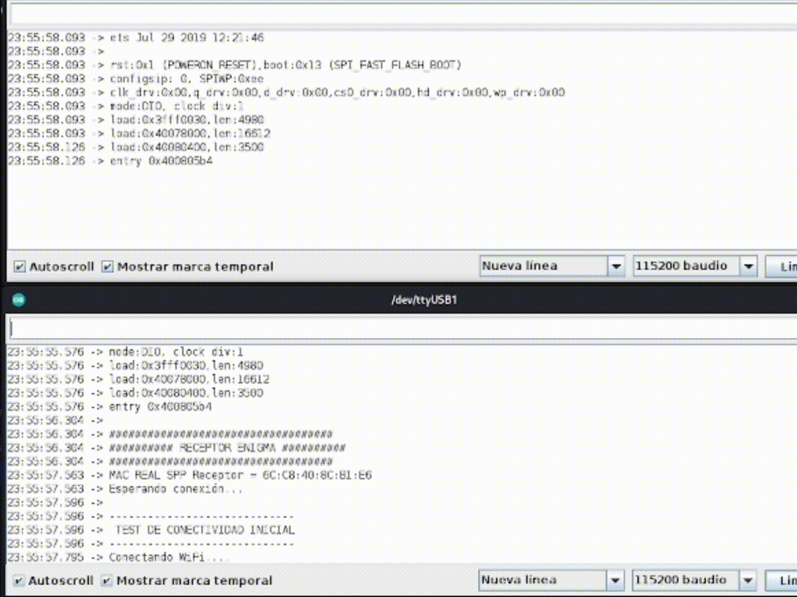
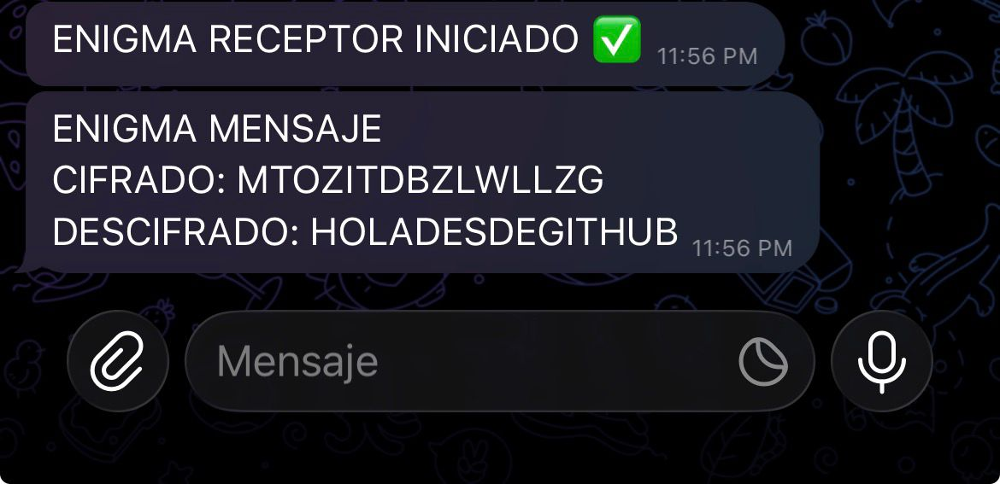

# 🔒 Modern Enigma Project: Bluetooth to Telegram Encryption (ESP32)

This project implements the **Enigma** cipher machine using two **ESP32** microcontrollers to create a secure communication system. The **Transmitter (Emisor)** encrypts the message and sends it via **Classic Bluetooth (SPP)**. The **Receiver (Receptor)** decrypts the message and forwards it to a **Telegram** chat, integrating Wi-Fi connectivity.

## Features

- **Enigma Cipher:** Implementation of the Enigma M3 algorithm (3-5 rotors, Reflector B, realistic *stepping*).
- **Transport Protocol:** Secure point-to-point communication via **Classic Bluetooth (SPP)**.
- **Authentication:** Implementation of an application *Handshake* (`AUTH:CLAVE`) to secure the Bluetooth link.
- **Data Format:** Use of **JSON** (via ArduinoJson) to transmit the cipher configuration (rotors, message, length).
- **IoT Integration:** The Receiver acts as a *gateway*, alternating between Bluetooth and Wi-Fi to send the decrypted result to **Telegram**.
- **Concurrency Management:** State alternation logic to resolve the radio conflict between Wi-Fi and Bluetooth on the ESP32.

---

## Installation and Deployment

Follow these steps to configure the *hardware* and *software* for your specific implementation.

### 1. Software Requirements

Install the following libraries from the **Arduino IDE Library Manager**:

- **`ArduinoJson`** (required for serializing/deserializing messages).
- **`BluetoothSerial`**, **`WiFi`**, **`HTTPClient`** (included in the ESP32 *core*).

### 2. Specific Hardware and IDE Configuration

It is crucial to use the correct board and *flashing* configuration for each module.

| Role | Module Model | IDE Configuration | Hardware Notes |
| :--- | :--- | :--- | :--- |
| **TRANSMITTER** | **ESP32-WROOM-32U** | **Board:** ESP32 Dev Module<br>**Flash Size:** 4MB (Default)<br>**Part. Scheme:** Default (4MB App/SPIFFS)<br>**Upload Speed:** 115200 baud | **Requires External Antenna** connected for proper Bluetooth operation. |
| **RECEIVER** | **ESP32-S** | **Board:** ESP32 Dev Module<br>**Flash Size:** 4MB<br>**Part. Scheme:** Minimal SPIFFS (1.9MB App)<br>**Upload Speed:** 115200 baud | |

---

### 3. Receiver Configuration (`RECEPTOR_Enigma.ino`)

This code manages Bluetooth reception, decryption, and Telegram output.

1.  **Network and Security Parameters:** Edit the configuration section in `RECEPTOR_Enigma.ino`:
    ```cpp
    // CHANGE: Must be identical to the one configured on the Transmitter.
    const String CLAVE = "CesarClaveSecreta"; 
    // CHANGE: Your Telegram bot token.
    #define BOT_TOKEN "YOUR_REAL_BOT_TOKEN" 
    // CHANGE: Your chat ID (where you will receive the message).
    #define CHAT_ID "YOUR_REAL_CHAT_ID"
    // CHANGE: Your Wi-Fi network credentials.
    #define WIFI_SSID "YOUR_WIFI_SSID"
    #define WIFI_PASS "YOUR_WIFI_PASSWORD"
    ```
2.  **Upload and Get MAC:** Upload the code to the ESP32 that will be the Receiver. Open the Serial Monitor (115200 baud). The device will print its **Bluetooth MAC (SPP)**. **Save this MAC.**

---

### 4. Transmitter Configuration (`EMISOR_Enigma.ino`)

This code manages the Serial interface, encryption, and Bluetooth transmission.

1.  **Receiver MAC:** Edit the configuration section in `EMISOR_Enigma.ino` with the MAC obtained in the previous step.
    ```cpp
    // CHANGE: MAC of the Receiver ESP32.
    uint8_t receptorMAC[] = {0x6C, 0xC8, 0x40, 0x8C, 0xB1, 0xE6}; 
    // CHANGE: Must be identical to the Receiver's.
    const String CLAVE = "CesarClaveSecreta";
    ```
2.  **Upload Code:** Upload the code to the ESP32 that will be the Transmitter.

---

## Usage Process (Cipher Flow)

Once both devices are powered on and uploaded:

1.  The Transmitter will initiate the point-to-point Bluetooth connection and the authentication *Handshake* (`AUTH:CLAVE`).
2.  If the connection is established correctly, the Transmitter will request the Enigma configuration (message, number, and rotor order) in its Serial Monitor.
3.  The Transmitter encrypts the message, packages it in **JSON** along with the configuration, and sends it to the Receiver via Bluetooth.
4.  The Receiver decrypts the message and sends a confirmation back via Bluetooth.
5.  **Simultaneously**, the Receiver executes the Alternation Logic: Disables BT, connects to Wi-Fi, and sends the decrypted result to the configured Telegram chat.

---

## Protocols and Stability

The project addresses the main limitation of the ESP32: concurrent use of Wi-Fi and Bluetooth.

### Alternation Logic (Receiver)

To ensure stability and performance, the Receiver strictly follows this sequence upon receiving a message:

1.  **Receive JSON (BT Active).**
2.  **Decrypt and Respond (BT Active).**
3.  **Disable BT** (`SerialBT.end()`).
4.  **Connect WiFi** and **Send to Telegram**.
5.  **Disable WiFi** (`WiFi.disconnect()`).
6.  **Reactivate BT** (`SerialBT.begin()`) to wait for the next message.

### Failure Handling (Transmitter)

The Transmitter includes a robust `loop()` routine to handle connection loss while the Receiver is busy with Wi-Fi:

- If `SerialBT.connected()` is false, the Transmitter attempts a **Persistent Reconnection** and performs a full **Re-Handshake** with the authentication key.
- **Synchronization Fix:** A forced **3-second delay** is introduced before attempting reconnection to ensure the Receiver has completed the Wi-Fi task and fully reactivated the Bluetooth server service.

---

## Demonstration and Evidence

### 4.1. Serial Monitor and Hardware Flow

Shows the physical setup and the process of data entry, encryption, and state alternation in the IDE.

**Physical Module Setup:**


**Serial Monitor Flow (Arduino IDE):**


| Description | Location |
| :--- | :--- |
| **Connection and Authentication** | `Transmitter Serial Monitor` |
| **Configuration Entry and Encryption** | `Transmitter Serial Monitor` |
| **Reception, Decryption, and Alternation** | `Receiver Serial Monitor` |

### 4.2. Telegram Result

Shows the final result of the secure communication, demonstrating IoT integration.

**Decrypted Message Received in Telegram:**


---

## Project Structure

```plaintext
enigma-esp32/
├── assets/
│   ├── hardware_setup.jpg
│   ├── serial_flow.gif
│   └── telegram_result.png
├── Emisor/
│   └── Emisor.ino          // Bluetooth Client, Encryption, Serial Interface
├── Receptor/
│   └── Receptor.ino        // Bluetooth Server, Decryption, WiFi/Telegram Client
└── LICENCIA                // Project license file
```

## 📧 Contact

- **LinkedIn:** [Cesar Gonzalez](https://www.linkedin.com/in/cesar-gonzalez-anaya/)
- **Github:** [ICaesarI](https://github.com/ICaesarI)
- **Email:** cesar.gonzalez.anayadev@gmail.com